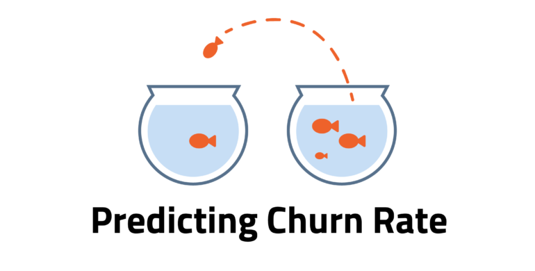
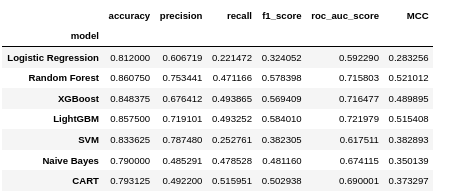
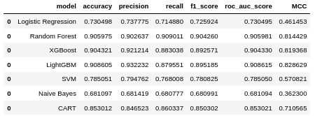
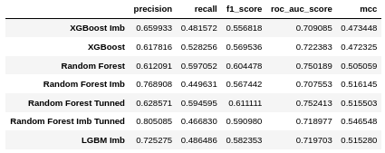

# Client Churn Prediction

  &nbsp; 
  

  &nbsp;

## Introduction

Using supervisioned machine learn model and learning to Rank metrics to evaluate customers with high probabilities to be in churn. Churn rate is one of the biggest expenditures of any organization, so with this model in production we can take actions to avoid customer churn and increase ROI% by ranking which client would the company give a gift card to and how much that amount would be, in order to maximize ROI.

The goal of this Readme is to show the context of the problem, the steps taken to solve it, the main insights and the overall performance.

**Project Development Method**

The project was developed based on the CRISP-DS (Cross-Industry Standard Process - Data Science, a.k.a. CRISP-DM) project management method, with the following steps:

- Business Understanding
- Data Collection
- Data Cleaning
- Exploratory Data Analysis (EDA)
- Data Preparation
- Machine Learning Modelling and fine-tuning
- Model and Business performance evaluation / Results
- Model deployment.

&nbsp; 
  

    
  

  &nbsp; 

#### This project was made by Marx Cerqueira.

---

## Contents
- [Introduction](#introduction)
- [1. Business Problem](#1-business-problem)
- [2. The Dataset](#2-the-dataset)
- [3. Solution Strategy](#3-solution-strategy)
- [4. Exploratory Data Analysis and Best Insights](#4-exploratory-data-analysis-and-best-insights)
- [5. Machine Learning Model Applied](#5-machine-learning-model-applied)
- [6. Machine Learning Model Performance](#6-machine-learning-model-performance)
- [7. Business Results](#7-business-results)
- [8. Conclusion](#8-conclusion)
- [9. Lessons Learned](#9-lessons-learned)
- [10. Next Steps to Improve](#10-next-steps-to-improve)
- [11.References](#11-references)

---

# 1. Business Problem.

**The Top Bank Company**

The Top Bank company operates in Europe with a bank account as the main product, this product can keep client's salary and make payments. This account doesn't have any cost in the first 12 months, however, after that time trial, the client needs to rehire the bank for upcoming 12 months and redo this process every year. Recently the Analytics Team noticed that the churn rate is increasing.

- Main Product: bank account without costs, valid for 12 months. After this period, the account must be renovated.

- Bank account revenue per client:
    - 15% of client's estimated salary, for clients with estimated income lower than the average;
    - 20% of client's estimated salary, for clients with estimated income greater than the average.

**Problem**

- Clients' churn rate has increased significantly in the last few months.

**Goal**
- Reduce clients' churn rate, which is, to avoid the client to cancel the contract and have them to renovate it for more 12 months.

**Deliverables**

- Model's performance and results report with the following topics:

    - What's the company's current churn rate?
    - How the churn rate varies per month?
    - What's the model's performance to label the clients as churns?
    - What's the company's revenue, if the company avoids the customers to get into churn through the developed model?

- Possible measure: discount coupon or other financial incentive
    - Which customers should receive an incentive and at what cost, in order to maximize the ROI (Return on investment)? - The sum of incentives shall not exceed $ 10,000.00.

[back to top](#table-of-contents)

# 2. The Dataset.
The dataset used in this project is available on Kaggle: https://www.kaggle.com/mervetorkan/churndataset

This dataset contain 10,000 rows and 14 columns that are described below:

- **RowNumber**: corresponds to the record (row) number and has no effect on the output.
- **CustomerID**: Unique client identifier and has no effect on customer leaving the bank.
- **Surname**: Client's surname and has no effect on customer leaving the bank.
- **CreditScore**: Client's credit card score for the financial market. can have an effect on customer churn, since a customer with a higher credit score is less likely to leave the bank.
- **Geography**: The country where the client lives and a customer’s location can affect their decision to leave the bank.
- **Gender**: Client's gender. it’s interesting to explore whether gender plays a role in a customer leaving the bank.
- **Age**: Client's age. This is certainly relevant, since older customers are less likely to leave their bank than younger ones.
- **Tenure**:  Refers to the number of years that the customer has been a client of the bank. Normally, older clients are more loyal and less likely to leave a bank. 
- **Balance**: The monetary amount the client has in their current account. Also a very good indicator of customer churn, as people with a higher balance in their accounts are less likely to leave the bank compared to those with lower balances.
- **NumOfProducts**: The number of products purchased by the client.
- **HasCrCard**: Point if the client has a credit card. This column is also relevant, since people with a credit card are less likely to leave the bank.
- **IsActiveMember**: Tell if the client is an active member of the bank (within the last 12 months). active customers are less likely to leave the bank.
- **EstimateSalary**: Client's annual salary estimate. As with balance, people with lower salaries are more likely to leave the bank compared to those with higher salaries.
- **Exited**: Indicates if the client is a churn (tagert variable). Whether or not the customer left the bank. (0=No,1=Yes)

# 3. Solution Strategy

My strategy to answers the Analytics Team and CEO questions, an exploratory data analysis will be performed, after that, a machine learning model will be developed following the strategy to answer the business questions

# 3.1. Step-by-step
**Step 01. Data Description:**

**Step 02. Feature Engineering:**

**Step 03. Data Filtering:**

**Step 04. Exploratory Data Analysis:**

**Step 05. Data Preparation:**

**Step 06. Feature Selection:**

**Step 07. Machine Learning Modelling:**

**Step 08. Hyperparameter Fine Tunning:**

**Step 09. Final Model:**

**Step 10. Convert Model Performance to Business Values:**

# 4. Top 3 Data Insights

**Hypothesis 01:**

**True/False.**

**Hypothesis 02:**

**True/False.**

**Hypothesis 03:**

**True/False.**

# 5. Machine Learning Model Applied

The following machine learning models were trained:
* Logistic Regression;
* Random Forest Classifier
* XGBoost Classifier
* LightGBM
* SVM
* Gaussian Nayve Bayes
* CART (Classification and Regression Trees)

All of them were cross-validated

# 6. Machine Learning Modelo Performance

It's worth remembering that this is a classification problem with imbalaced data. Due this, the accuracy metric alone does't tell us much about the model, and for a better analysis I have to use other metrics such as recall, F1-Score and MCC.

# 5.1. Models Perfomance on Training Dataset

Performance tables on unbalanced and balanced data:

# 5.2. Models Perfomance on Test Data

Performance table on unseen data (test dataset) which is unbalanced

models graphics

# 7. Business Results

# 8. Conclusions

# 9. Lessons Learned

# 10. Next Steps to Improve

# LICENSE

# All Rights Reserved - Comunidade DS 2021
